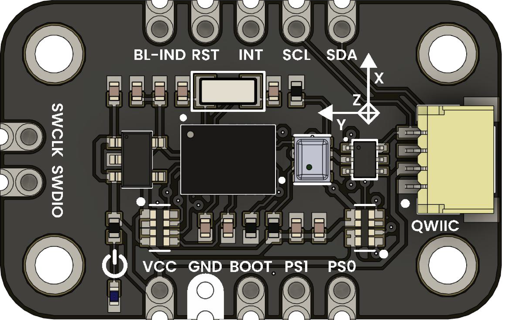

# DevLab: I2C BNO055 + BMP280 Fusion Sensor

This module combines two high-performance sensors on a single board:

- **BNO055**: 9-DOF absolute orientation sensor (accelerometer, gyroscope, magnetometer) with on-board sensor fusion.  
- **BMP280**: high-precision barometric pressure and temperature sensor.

Perfect for robotics, inertial navigation, drones, environmental monitoring and IoT projects.

    <a href="#"> BNO055 + BMO280 Module</a>
     

## Additional Resources

### Quick Setup

## Features

- **BNO055**  

| **Feature**                  | **Description**                                        |
|------------------------------|--------------------------------------------------------|
| **On-chip sensor fusion**    | `quaternions`, `Euler angles`, `gravity vectors`, etc. | 
| **Accelerometer** ranges     | ±2/4/8/16 g                                            |  
| **Gyroscope** ranges         | ±125/250/500/1000/2000 °/s                             |
| **Magnetometer** ranges      | ±1.3/1.9/2.5/4.0/4.7/5.6/8.1 gauss                     | 
| **Protocol**                 | `I²C`, `UART` (select via PS0/PS1)                     | 

- **BMP280**  

| **Feature**              | **Description**            |
|--------------------------|----------------------------|
| **Pressure range**       | 300…1100 hPa (±10…+1 m)    |
| **Temperature accuracy** | ±1 °C                      |
| **Protocol**             | `I²C`, `UART`, `SWD`       |

- **SWD programming/debugging** via SWCLK/SWDIO  
- **JST-SH QWIIC connector** (GND, VCC, SDA, SCL)  

## Module Applications

| Application                          | Description                                                                 |
|--------------------------------------|-----------------------------------------------------------------------------|
| Portable weather station          | Measures temperature, humidity, and pressure accurately.                    |
| Altimeter / variometer            | Calculates altitude based on atmospheric pressure.                          |
| Posture tracking                  | Detects body tilt or rotation.                                              |
| Inertial navigation               | Tracks movement and orientation without GPS.                                |
| Augmented / virtual reality       | Provides orientation for 3D environments.                                   |
| Flight controller                 | Stabilization for drones or robots.                                         |
| Gesture interface                 | Uses motion to control devices.                                             |
| IoT environmental logging         | Collects and transmits environmental conditions.                            |

##  Recommendations

- Recommended power: 3.3 V.
- Use **Processing** or **Unity** for 3D visualization.

## License
This project is licensed under the MIT License - see the [LICENSE](LICENSE) file for details.
