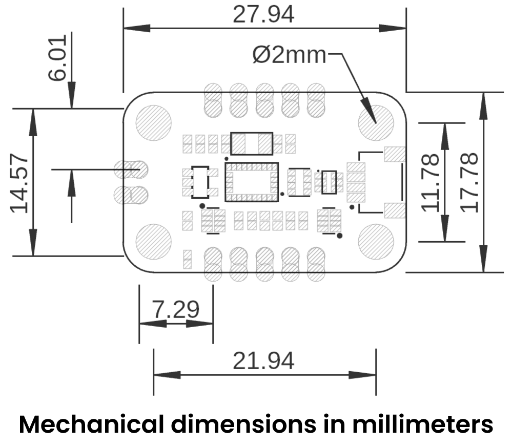
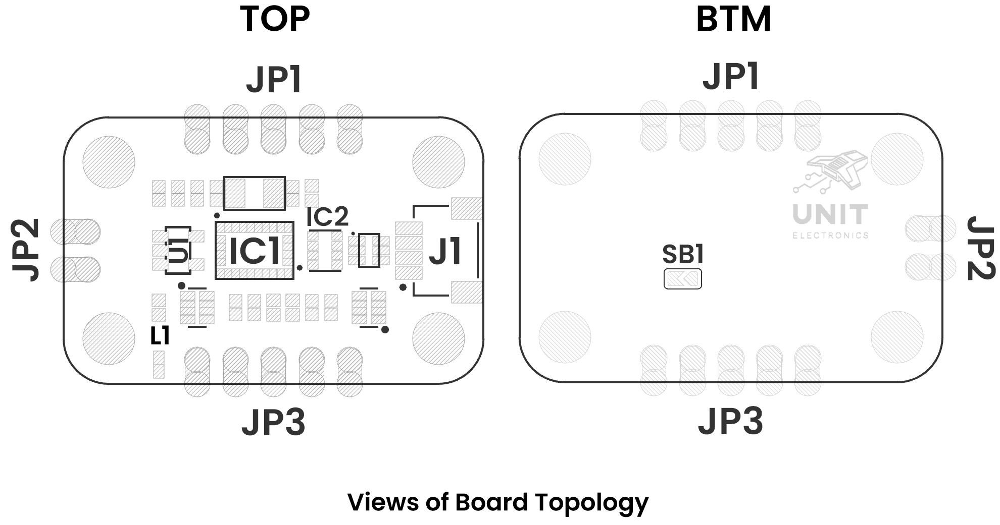

# Schematic

    <a href="#"> Schematic</a>
     

# Pinout

    <a href="#"> Pinout</a>
     

## Description

| Pin        | Function                 | Description                                                                                |
|------------|--------------------------|--------------------------------------------------------------------------------------------|
| **VCC**    | Power                    | 3.3 V supply                                                                               |
| **GND**    | Ground                   | Ground reference                                                                           |
| **SDA**    | I²C Data                 | I²C data line shared by BNO055, BMP280 & QWIIC connector.                                  |
| **SCL**    | I²C Clock                | I²C clock line shared by BNO055, BMP280 & QWIIC connector.                                 |
| **INT**    | Interrupt                | BNO055 interrupt output                                                                    |
| **RST**    | Reset                    | External reset input for BNO055 (does not reset the MCU).                                     |
| **BL-IND** | Bootloader indicator    | --                                                                                         |
| **BOOT**   | BOOT0                    | High during reset → Enters STM32 internal bootloader for firmware update.                             |
| **PS0**    | Protocol Select 0        | Protocol bit 0                                                                             |
| **PS1**    | Protocol Select 1        | Protocol bit 1                                                                             |
| **SWCLK**  | SWD Clock                | Serial Wire Debug clock for STM32 programming/debugging.                                   |
| **SWDIO**  | SWD Data                 | Serial Wire Debug data for STM32 programming/debugging.                                    |
| **QWIIC**  | JST-SH I²C Connector     | QWIIC-compatible 4-pin I²C: GND, VCC, SDA, SCL (identical to the separate SDA/SCL pins).      |

> **Note:** Always power the board with 3.3 V and never exceed the rated voltage. Set PS0/PS1 to select your sensor interface before applying power.

## Connections

1. **Power**  
   - **VCC** → 3.3 V  
   - **GND** → GND  

2. **I²C (sensors & QWIIC bus)**  
   - **SDA** → I²C data line  
   - **SCL** → I²C clock line  

3. **STM32 SWD (program/debug)**  
   - **SWCLK** → SWD clock  
   - **SWDIO** → SWD data  

4. **Control & Status**  
   - **RST** → External reset for the BNO055 sensor  
   - **INT** → BNO055 interrupt output (e.g. data-ready)  
   - **BL-IND** →   --

5. **Mode Selection (BNO08x)** 
    
   | **Protocol select**| **I2C** | **UART** | **HID - I2C** |
   |--------------------|---------|----------|---------------|
   |**PS0**             |GND      |GND       |VDD            |
   |**PS1**             |GND      |VDD       |GND            |  

6. **QWIIC Connector (JST-SH 4-pin)**  
   - Pin 1: GND  
   - Pin 2: VCC (3.3 V)  
   - Pin 3: SDA  
   - Pin 4: SCL  

---

# Dimensions

    <a href="#"> Dimensions</a>
     

# Topology

    <a href="#"> Dimensions</a>
     

| Ref.  | Description                                                                 |
|-------|-----------------------------------------------------------------------------|
| IC1   | BNO055                                                                      |
| IC2   | BMP280                                                                      |
| U1    | AP2112K 3.3V LDO voltage regulator                                          |
| L1    | Power-on LED                                                                |
| SB1   | Solder bridge to select I²C address                                         |
| J1    | Low-power I²C QWIIC JST connector                                           |
| JP1   | 2.54 mm pin header                                                          |
| JP2   | 2.54 mm pin header                                                          |
| JP3   | 2.54 mm pin header                                                          |